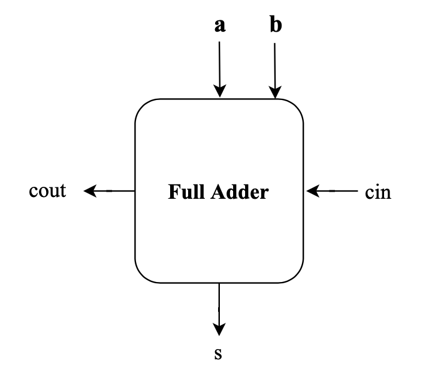
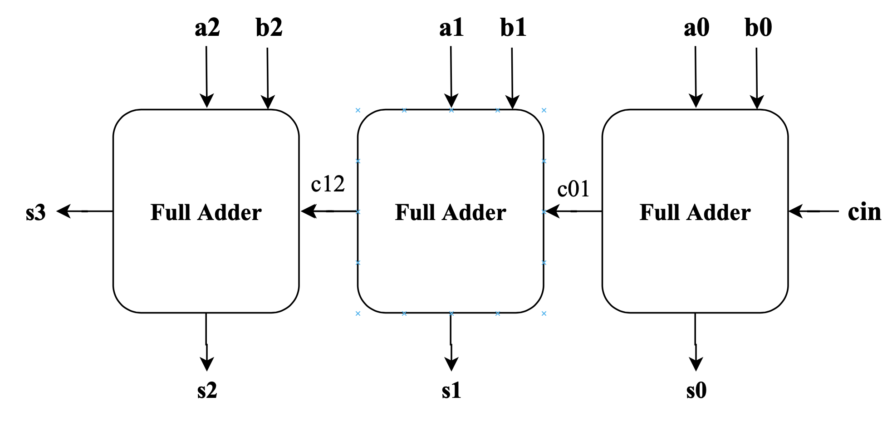

# Logic Design Fundamentals: Adders
An adder is a hardware module that finds the sum of two input numbers. Adders have a wide variety of uses in hardware. The simplest form of an adder, a **half adder**, adds two bits to get a sum and a carry. A **full adder** extends the functionality of a half adder by also adding a  "carry in" bit. Full adders are used to create adders for multi-bit numbers. Many adders are implemented as a **ripple carry adder**. In this folder, you will find adder.v, which implements several modules. 

The module *full_adder* implements a full adder. Module *adder_4b* implements a ripple carry adder that sums two 4-bit numbers. The module *adder_16b* implements an adder for 16-bit numbers by instantiating four adder_4b and wiring them together. Both are done using structural Verilog. The addition operator "+" is a behavioral Verilog feature. 

 

---

## **Realizing a Full Adder Logic Circuit**

A full adder is a combinational logic circuit that performs the addition of 3 bits to get a sum bit and carry bit. We need to make a full adder before we make a ripple-carry adder. 

 

### **Truth Table: Full Adder**
|  a|  b| cin| sum| carry|
|---|---|----|---:|-----:|
|  0|  0|   0|  0|      0|
|  0|  0|   1|  1|      0|
|  0|  1|   0|  1|      0|  
|  0|  1|   1|  0|      1|
|  1|  0|   0|  1|      0|
|  1|  0|   1|  0|      1|
|  1|  1|   0|  0|      1|
|  1|  1|   1|  1|      1| 

 

Let's find the SOP for the sum and carry outputs. The sum is high for minterms 1, 2, 4, and 7. The carry is high for minterms 3, 5, 6, and 7. 

    // Full Adder using SOP
    sum   = (a & b & cin) | (a & ~b & ~cin) | (~a & b & ~cin) | (~a & ~b & cin);
    carry = (a & b & cin) | (a & b & ~cin) | (a & ~b & cin) | (~a & b & cin);

SOP is a tried-and-true method for describing a circuit. However, we can do better. Take a look back at the truth table and notice that the sum is high when only 1 input is high, or when all 3 inputs are high. We can use an XOR for sum. The carry is high when 2 or 3 of the inputs are high. If two inputs are high, we know the carry should be high and there is not need to check the third bit.

    // A more intuitive approach
    sum = (a ^ b ^ cin);
    carry = (a & b) | (a & cin) | (b & cin);

The expressions above could be reached by simplifying the SOP expressions found above. 

 

## **Creating a Ripple Carry Adder**

A ripple-carry adder is a logic circuit that adds two binary numbers bit by bit. Much like column addition, this type of adder sums the bits one column (2s-place) at a time, noting their sum and sending any carryout to the next column. In this way bits “ripple” through the adder - the sum is accurate when the last
carryout bit has updated.